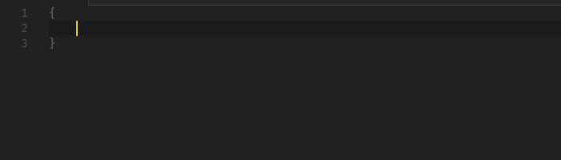
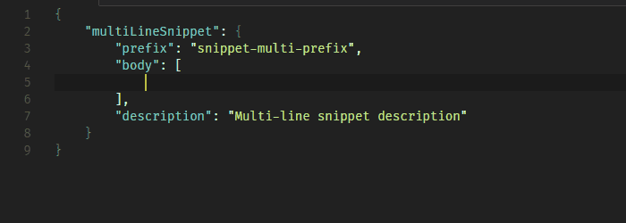

# Custom Snippets

[Custom Snippets][marketplace-url] is code snippet for creating your own snippets.

## Demo

#### Custom Snippets: Single Line



#### Custom Snippets: Multiple Lines


#### Custom Snippets: Multiple Lines on Body



## Installation

1. Visit [VSCode Market: Custom Snippets][marketplace-url].<br><br>**OR**

2. By VSCode
   * Open VSCode
   * Launch VS Code Quick Open (press **Ctrl+P**) 
   * Paste the following command

     ```
     ext install vscode-custom-snippets
     ```
   * Press **Enter** to search the extension
   * Select **Custom Snippets** 
   * Install

> **Tip:** If you open [README][readme-url] on GitHub, you can install [Clipboardy][clipboardy-chrome-webstore], a Chrome extension, for copying the command listed above to clipboard.
> For more information, please visit [Clipboardy Chrome Extension Homepage][clipboardy-homepage].

## Usage

Type snippet prefix, and IntelliSense will show the snippet. If IntelliSense doesn't show the snippet, press **Ctrl+Space** and then **Enter** to insert the snippet.

Snippet Name | Prefix | Description
--- | --- | ---
[snippetSingleLine][demo-single-src] | `snippet-single` | Create a custom snippet with a single body
[snippetMultiLine][demo-multiple-src] | `snippet-multi` | Create a custom snippet with multiple lines
[snippetMultiLineBody][demo-body-src] | `snippet-multi-body` | Add another snippet on the body of multi-line custom snippet

[marketplace-url]: https://marketplace.visualstudio.com/items?itemName=NgekNgok.vscode-custom-snippets
[readme-url]: https://github.com/alyyasser/vscode-CustomSnippets/blob/master/README.md

[demo-single-src]: https://github.com/alyyasser/vscode-CustomSnippets/blob/75d2d095bbdd2412bf4c1cc25ab0a209deaa45bd/snippets/snippets.json#L2
[demo-multiple-src]: https://github.com/alyyasser/vscode-CustomSnippets/blob/75d2d095bbdd2412bf4c1cc25ab0a209deaa45bd/snippets/snippets.json#L13
[demo-body-src]: https://github.com/alyyasser/vscode-CustomSnippets/blob/75d2d095bbdd2412bf4c1cc25ab0a209deaa45bd/snippets/snippets.json#L26

[clipboardy-chrome-webstore]: https://chrome.google.com/webstore/detail/clipboardy/gkafpbdjggkmmngaamlghmigadfaalhc
[clipboardy-homepage]: https://rainsoft.io/clipboardy-chrome-extension
