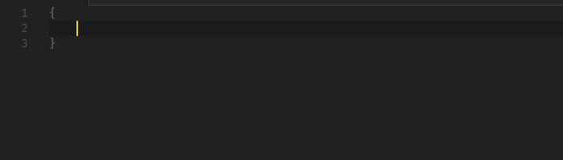
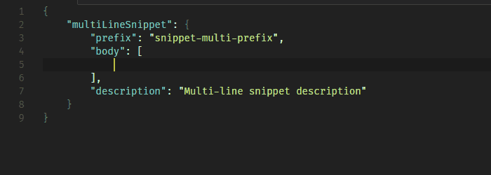

# Custom Snippets

Code snippet for creating your own snippets.

## Demo

- Custom Snippets: Single Line


- Custom Snippets: Multiple Lines



- Custom Snippets: Multiple Lines on Body



## Installation

- Visit [VSCode Market: Custom Snippets](https://marketplace.visualstudio.com/items?itemName=NgekNgok.vscode-custom-snippets).
OR

- By VSCode

1. Open VSCode
2. Launch VS Code Quick Open (press **Ctrl+P**) 
3. Paste the following command
    ```
    ext install vscode-custom-snippets
    ```
    
4. Press **Enter** to search the extension
5. Select **Custom Snippets** 
6. Install.

> **Tip:** If you open [README](https://github.com/alyyasser/vscode-CustomSnippets/blob/master/README.md) on GitHub, you can install [Clipboardy](https://chrome.google.com/webstore/detail/clipboardy/gkafpbdjggkmmngaamlghmigadfaalhc),a Chrome extension for copying the command above, to clipboard.
> For more information, please visit [Clipboardy Chrome Extension Homepage](https://rainsoft.io/clipboardy-chrome-extension/). 

## Usage

Type snippet prefix, and IntelliSense will show the snippet. If IntelliSense doesn't show the snippet, press **Ctrl+Space**, then press **Enter** to insert the snippet.

Snippet Name | Prefix | Description
--- | --- | ---
snippetSingleLine | `snippet-single` | Create custom snippet with a single body
snippetMultiLine | `snippet-multi` | Create custom snippet with multiple lines
snippetMultiLineBody | `snippet-multi-body` | Add another snippet on body to multi-line custom snippet
