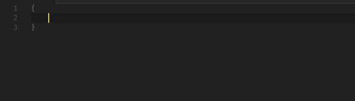
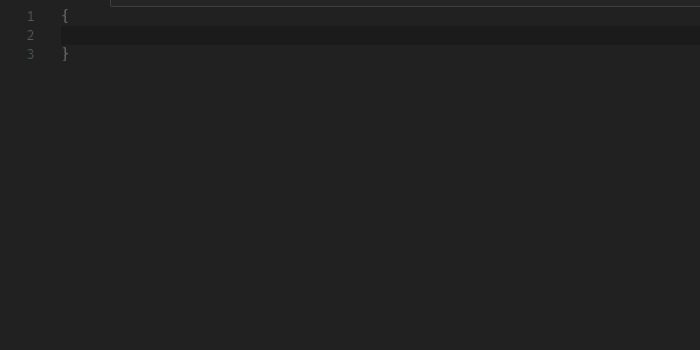

# Custom Snippets

Code snippet for creating custom snippets or creating your own snippets





## Installation

- Visit [VSCode Market: Custom Snippets](http://).
- Or open VSCode, press **F1** then type the command below, and press **Enter** to install.
```
ext install vscode-custom-snippets
```

## Usage

Type snippet prefix, it will appear in IntelliSense, if it doesn't, press **Ctrl+Space**, then press **Enter** to insert the snippet.

Snippet Name | Prefix
--- | ---
Custom Snippets: Single | `customSnippetSingle`
Custom Snippets: Multiple | `customSnippetMultiple`